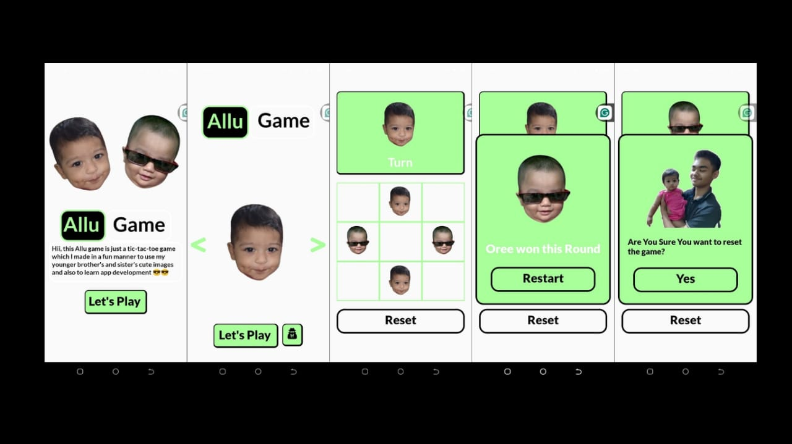

# Allu App

this is an app which I am making as a learning purpose for my react native journey. the target is to learn new aspect off app development. So far I learned.

- Implementing Onboard Screens
- Carousels 
- adding Sound effects in buttons
- Some native style rules
- made a whole tic-tac-tow game 
- worked with modals
- worked with audion features